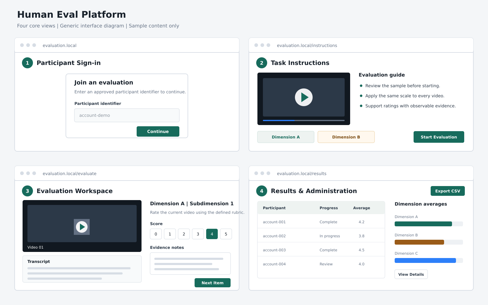

# Human Eval Platform

A lightweight, self-hosted platform for structured human evaluation of videos or other annotation tasks. Evaluation tasks are defined in JSON, while participant progress and results are stored in SQLite.



This public repository contains only a generic demo, locally generated media, and synthetic configuration. It does not include research data, participant records, credentials, server addresses, or private deployment settings.

## Features

- Configurable videos, instructions, dimensions, questions, score ranges, and confidence ratings.
- Participant allowlist, persistent sessions, randomized video order, and automatic draft saving.
- Scrollable video transcripts with text quoting, highlighting, and video timestamp references.
- Sequential task unlocking and revision requests from administrators.
- Read-only result review, per-dimension statistics, overall scores, and CSV export.
- Browser caching, ETag, HTTP Range requests, bandwidth controls, and traffic alerts.
- Vanilla HTML, CSS, and JavaScript frontend with a Python standard-library backend.

## Quick Start

Requires Python 3.10 or later.

```bash
git clone <repository-url>
cd Human_Eval_Platform
export HEP_ADMIN_PASSWORD='replace-with-a-strong-password'
python3 app.py --config config.example.json
```

Open `http://127.0.0.1:8000`. The demo accepts either `account-demo` or `account-test` as the participant identifier.

The evaluation workflow remains available without `HEP_ADMIN_PASSWORD`, but the administration and results views are disabled.

## Create an Evaluation

1. Copy `templates/evaluation_flow_template.json` into `data/flows/`.
2. Place videos and matching transcript files under `storage/videos/<task-name>/`.
3. Configure videos, dimensions, questions, and scoring rules in the workflow JSON.
4. Add permitted participant identifiers to `docs/participant-allowlist.md`.
5. Restart the server to import the new workflow.

See [workflow configuration](templates/README.md) and [data configuration](docs/configuration-and-data.md) for the complete schema.

## Data and Deployment

Runtime data is stored in `storage/human_eval.db` and excluded from Git. Local configuration, exports, generated previews, and participant data are also ignored by default.

For public deployment, use HTTPS, set a strong administrator password, enable secure cookies, and place the service behind a production reverse proxy and firewall.

## Tests

```bash
python3 -m unittest discover -s tests
python3 -m py_compile app.py human_eval_platform/*.py
npm install
npm test
```

## Research Use

This platform was developed for the human-evaluation stage of a research project. The formal paper citation will be added after publication.

## License

The platform code is released under the MIT License. The bundled demo media is synthetic and contains no third-party footage.
